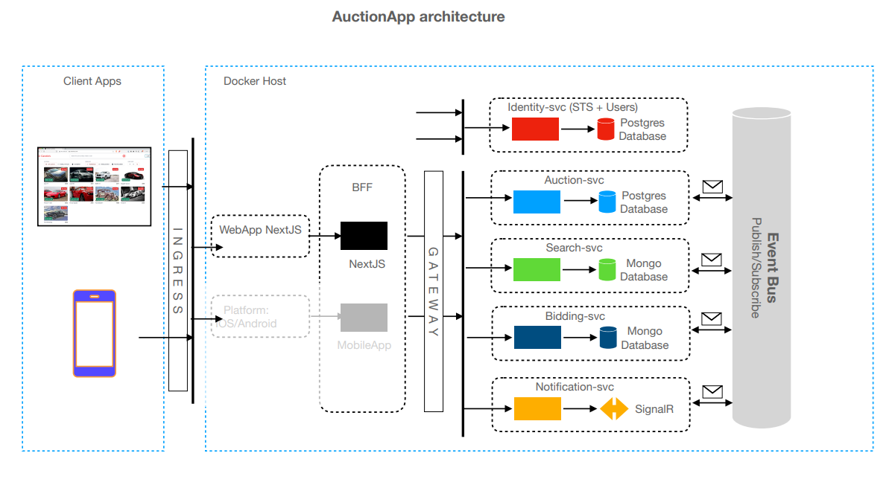

# AuctionApp

Online auction platform built with a microservices architecture, ensuring scalability, modularity, and high performance. This repository contains the source code and documentation needed to set up and run the application.

---

## 🌟 **Key Features**
- **WebApp**: Web application built with Next.js for a fast and responsive user experience.
- **Microservices Architecture**:
  - Independent services for authentication, auctions, search, bidding, and notifications.
  - Asynchronous communication between services using **Event Bus** (Publish/Subscribe).
- **Real-Time Notifications**: Implemented with **SignalR** for WebSocket communication.
- **Specialized Databases**:
  - **PostgreSQL**: For relational data.
  - **MongoDB**: For flexible, unstructured data.
- **Planned Kubernetes Support**: Kubernetes will be implemented in the future for enhanced orchestration and scaling.

---

## 🛠️ **Architecture**

### Diagram


### Description
The application follows a modern and decoupled architecture:
1. **Client App**:
   - Web interface built with **Next.js**.
2. **Backend**:
   - **Gateway** for orchestration and security.
   - **BFF (Backend for Frontend)**:
     - Built using **Server Side Actions** of Next.js to handle server-side data processing and streamline client interactions.
   - Specialized, independent services:
     - `Identity-svc`: User management and authentication.
     - `Auction-svc`: Auction control.
     - `Search-svc`: Catalog searches.
     - `Bidding-svc`: Bid management.
     - `Notification-svc`: Real-time notifications.
3. **Event Bus**:
   - Implemented with **RabbitMQ** and orchestrated using **MassTransit** to enable Publish/Subscribe messaging for asynchronous communication between services.
4. **Databases**:
   - **PostgreSQL**: For transactional services.
   - **MongoDB**: For flexible data and fast queries.

---

## 🚀 **Technologies Used**
- **Frontend**: Next.js
- **Backend**: C# with .NET Core
- **Event Bus**: RabbitMQ with MassTransit
- **Databases**: PostgreSQL, MongoDB
- **Real-Time Communication**: SignalR
- **Infrastructure**: Docker, Kubernetes (planned implementation)

---

## ⚙️ **Setup and Execution**

### Prerequisites
1. **Docker** and **Docker Compose** installed on your system.
2. **.NET SDK** (if you want to run the backend locally).
3. **Node.js** (if you want to run the frontend locally).

### Steps
1. Clone the repository:
   ```bash
   git clone https://github.com/carlosmax/AuctionApp.git
   cd auctionapp
